::: {.callout-tip title="Lernziele"}
- EM mit Dipolquellen
- Messgrößen
- Interpretation
- Grenzen
:::

## Einführung

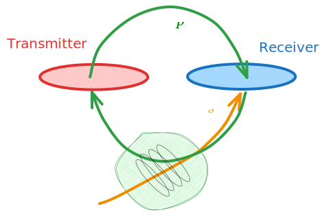

Über Transmitter **TX** (Spule, geerdetes Kabel) wird Feld angekoppelt.

- Magnetfeld $\mathbf{H}$
- Elektrisches Feld $\mathbf{E}$

Primäres, zeitlich variables Magnetfeld induziert im Leiter Wirbelströme.
Diese besitzen wiederum ein Magnetfeld, das sich in Stärke, Richtung und Phase vom primären Feld unterscheidet.

Wir messen $\vb B$ im Receiver **RX** als Funktion von Frequenz und Transmitter-Receiver-Abstand (Offset).

Frequenz und Offset sind technische Sondierungsparameter, die gesteuert werden können in Abhängigkeit von

- Targettiefe
- Targetgröße und Leitfähigkeit.

In Abhängigkeit von der geophysikalischen Fragestellung sind zwei methodische Varianten in Verwendung:

- Kartierung
- Sondierung

_Kartierung_ durch Bewegung von TX und RX entlang eines Profils oder auf einer Fläche unter Beibehaltung des Abstandes (TX-RX-Offset)
_Sondierung_ durch Veränderung von Frequenz und/oder Offset.

Es gibt auch Varianten, die eine Kombination von Kartierung und Sondierung realisieren (Beispiel: Aero-EM)

Wir unterscheiden zwei grundsätzliche Varianten:

- Abstandssondierung
- Frequenzsondierung

## Dipolquellen

### Magnetischer Dipol

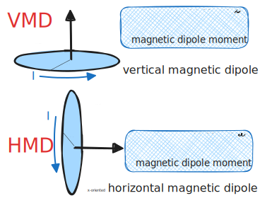

### Elektrischer Dipol

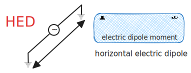

## EM-34

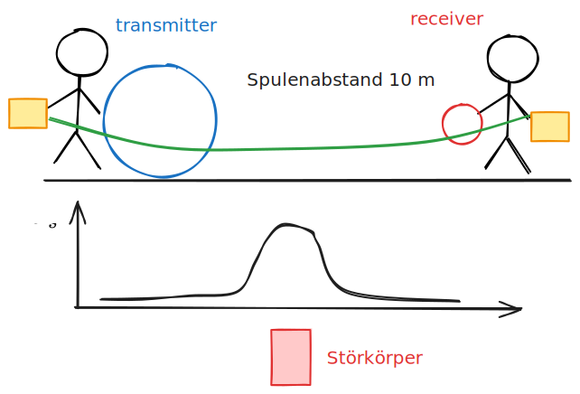

### Spulenkonfigurationen

Unterschiedliche Transmitter-Receiver-konfigurationen bewirken unterschiedliche

- Kopplung
- Eindringtiefe
- Response-Charakteristik

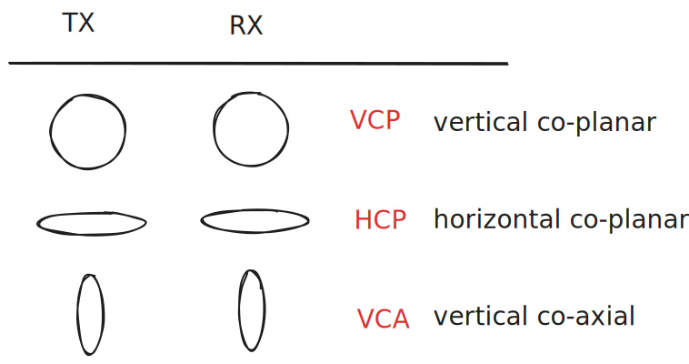


### EM-34 Konfigurationen

Für die Apparatur EM-34 gelten die folgenden Abschätzungen für die Tiefenreichweite (in Metern) bei typischen Offset-Frequenz-Konfigurationen:

| r in m   | VCP   | HCP   | f in Hz |
| --- | ----- | ----- | ------- |
| 10  | 6-7.5 | 12-15 | 6400    |
| 20  | 12-15 | 25-30 | 1600    |
| 40  | 24-30 | 50-60 | 400     |

Produkt aus $\omega$ und $r^{2}$ ist konstant.
$$
\omega r^{2} = \text{const}
$$
Induktionszahl:

$$
|k|r = \sqrt{\omega \mu_{0} \sigma } r
$$

Es gilt die _LIN_- oder _low induction number_-Näherung, wenn $|k|r \ll 1$

### LIN: Abhängigkeit von der elektrischen Leitfähigkeit

```{python}
#| code-fold: true
#| echo: true
import numpy as np
import matplotlib.pyplot as plt
sigma = np.logspace(-5, 0, 51)
f = [400, 1600, 6400]
r = [40, 20, 10]

fig, ax = plt.subplots(figsize=(8, 4))
ax.loglog(1 / sigma, [np.abs(np.sqrt(-1j* 2 * np.pi * f[0] * np.pi * 4e-7 * s)) * r[0] for s in sigma]) 
ax.set_xlabel(r"$\rho$ in $\Omega \cdot$m")
ax.set_ylabel(r"$|k|r$")
ax.grid(alpha=0.4)
```

### Azimutabhängigkeit bei steilstehenden Leitfähigkeitsanomalien

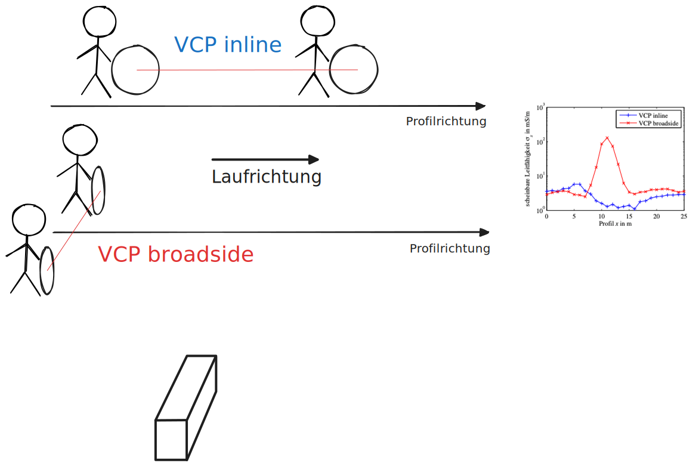


### Beispiele

Die Apparatur EM-34 berechnet intern die _scheinbare Leitfähigkeit_ auf Grundlage der LIN-Näherung:

$$
\sigma_s = \frac{4}{\omega\mu_0 r^2} \,\mathrm{imag}\left ( \frac{H}{H_0} \right)
$$

Wir rechnen mit `empymod` nach.

```{python}
#| echo: true
#| code-fold: true
import empymod
import numpy as np
import matplotlib.pyplot as plt

def VCP(res, freq, offset, height):
    src = [0, 0, -height, 90, 0]
    rec = [offset, 0, -height, 90, 0]
    depth = 0.0
    inp = {'src': src, 'rec': rec, 'depth': depth, 'res': [2e20, res],
       'freqtime': freq, 'verb': 1, 'xdirect': True}
    fhz_num = empymod.loop(**inp)
    return fhz_num

def rhoa(H, offset, freq):
    omega = 2 * np.pi * freq
    hz_air = -1.0 / (4 * np.pi * offset**3)
    sig = 4 / (omega * mu0 * offset**2) * np.imag(H / hz_air)
    return 1 / sig

mu0 = np.pi * 4e-7
```

```{python}
#| echo: true
offset = 10.0
freq = 6400.0
h = 0.0
rho = 500.0
H = VCP(rho, freq, offset, h)
print(f"rhoa = {rhoa(H, offset, freq):.2f}")
```


```{python}
RHO = np.logspace(0, 4, 41)
fig, ax = plt.subplots(figsize=(6, 6))
ax.loglog(RHO, [rhoa(VCP(v, freq, offset, h), offset, freq) for v in RHO], label="LIN")
ax.loglog(RHO,RHO, label="true")
ax.set_title("Scheinbarer spezifischer Widerstand eines \n homogenen Halbraums berechnet aus LIN-Näherung")
ax.set_xlabel(r"$\rho$ in $\Omega\cdot$m")
ax.set_ylabel(r"$\rho_{s}$ in $\Omega\cdot$m")
ax.legend()
ax.grid(alpha=0.5)
```

### LIN-Näherung

Wir stellen die Magnetfeldresponse eines VMD über einem homogenen Halbraum dar. 
Variiert wird hier nur die Leitfähigkeit, während die Frequenz konstant gehalten wird.

Wir beobachten einen typischen Verlauf von Real- und Imaginärteil.

Für die Kalibrierung der scheinbaren Leitfähigkeit bei der Anzeige der Messwerte wird folgendes ausgenutzt:

- Annahme eines homogenen Halbraums
- Realteil konstant
- Imaginärteil ist nur eine Funktion von $\sigma$, wenn $\omega r^2$ konstant 
- Kalibrierung liefert _scheinbare Leitfähigkeit_ $\sigma_{a}$ in mS/m

```{python}
data = np.array([VCP(1 / s, freq, offset, h) for s in sigma])
Hz0 = -1.0 / (4 * np.pi * offset**3)
kr = np.array([np.abs(np.sqrt(-1j* 2 * np.pi * freq * np.pi * 4e-7 * s)) * offset for s in sigma])
fig, ax = plt.subplots(figsize=(8, 4))
ax.set_xlabel("|k|r")
ax.set_ylabel(r"$H_{z}$ in A/m")
ax.loglog(kr, np.abs(np.real(data)), label="Re")
ax.loglog(kr, np.abs(np.imag(data)), label="Im")
ax.legend()
ax.grid(alpha=0.5)
```

## Hubschrauber-EM


- TX: Magnetischer Dipol
- RX: Induktionsspule
- Konfiguration: HCP
- Kartierung mit Frequenzsondierung

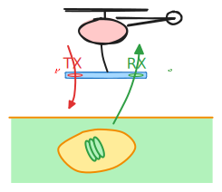


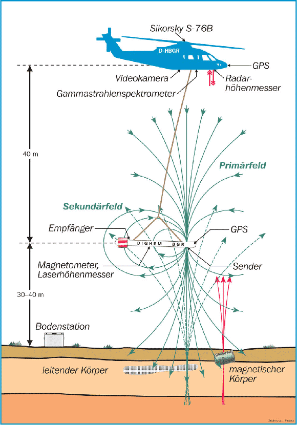

### Das Fugro DIGHEM System

| DIGHEM                     |                                                                       |
| -------------------------- | --------------------------------------------------------------------- |
| Aufgabe                    | Bestimmung der elektrischen Leitfähigkeit bis zu Tiefen von eta 150 m |
| Abstand TX-RX              | 7.9 bis 8.0 (für jede Frequenz verschieden)                           |
| Frequenzen in Hz           | 375, 1778, 8510, 37830, 129000                                        |
| Spulenkonfiguration        | HCP                                                                   |
| Hersteller                 | Fugro Airborne Survey (Kanada)                                        |
| Sensorhöhe                 | 30 m                                                                  |
| Fluggeschwindigkeit        | 140 km/h                                                              |
| Abtastrate                 | 10 Hz                                                                 |
| Räumliches Abtastintervall | 4 m                                                                   |
| Weitere Messgeräte         | Cs-Magnetometer Geometrics (USA)                                      |
| davon im Hubschrauber      | Gammastrahlen-Spektrometer, DGPS, Höhenmesser                         |

### Messgröße HEM

Nach Kompensation (Auslöschung des Primärfeldes im RX) misst RX nur das sekundäre Magnetfeld $\vb{H}_{s}$.


In HCP-Konfiguration beträgt das Vakuum-Feld im RX im Abstand $r$ vom TX
$$
H_{0}(r) = - \frac{1}{4 \pi r^{3}}.
$$
Das im RX gemessene Vertikalfeld ist damit
$$
H_{s}(\omega) = \vb{H}(\omega)\cdot \vb{e}_{z} - {H}_{0} = H_{z}(\omega) - H_{0}
$$

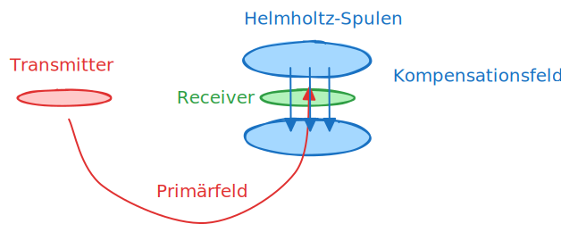


### Darstellungsgrößen

Das komplexwertige kompensierte Magnetfeld wird auf das Vakuumfeld normiert und in Real- und Imaginärteil zerlegt.

Rechnerisch:
$$
\frac{H_{s}}{H_{0}} = \frac{\mathrm{Re}(H_{z}) + i \mathrm{Im}(H_{z}) - H_{0}}{H_{0}}
$$

$$
\overline R = \mathrm{Re} \left( \frac{H_{s}}{H_{0}} \right) = \frac{\mathrm{Re}(H_{z})}{H_{0}}-1  , \qquad \overline Q = \mathrm{Im} \left( \frac{H_{s}}{H_{0}} \right) = \frac{\mathrm{Im}(H_{z})}{H_{0}}
$$
In der Praxis werden diese Größen in _ppm_ (parts per million, $10^{-6}$) dargestellt:
$$
R := \overline R \times 10^{6}, \qquad Q := \overline Q \times 10^{6}
$$
R: Realteil oder _real part_

Q: Imaginärteil oder _quadrature part_

### Beispiele: Salzwasserintrusion Cuxhavener Rinne (BGR)

::: {.columns}
::: {.column}
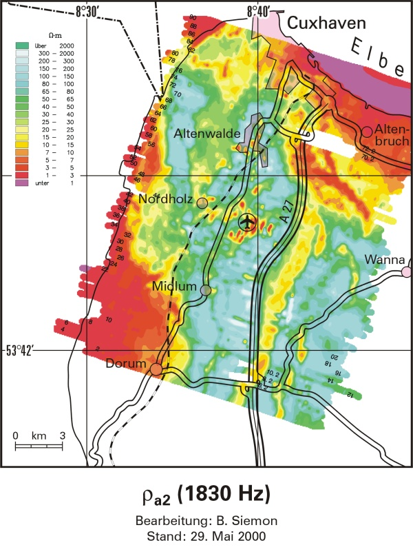
:::
::: {.column}
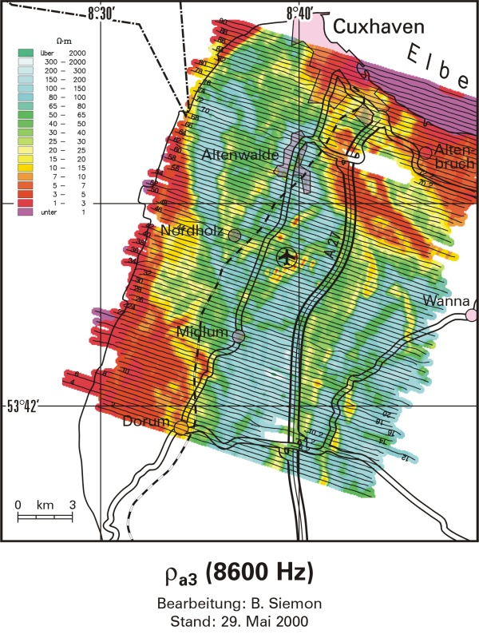
:::
:::

### Anwendungsbeispiel

::: {.callout-note title="Lernziel"}

- Darstellungsgrößen der Hubschrauberelektromagnetik
- Modellierung in 1-D
- Horizontal-koplanare Spulenanordnung (**H**orizontal **C**o-**P**lanar)
- Vertikaler Magnetischer Dipol
- Vakuumresponse in HCP
- Anwenden von `empymod` 

:::


### Synthetische Datensätze

Wir erstellen synthetische Datensätze für eine horizontal-koplanare Spulenaufstellung. Der Spulenabstand beträgt 8 m. Die diskreten Frequenzen sind
$$
f \in (387, 1820, 8225, 41550, 133200) \text{ Hz.}
$$
Die spezifischen Widerstände der 4 Schichten sind
$$
\rho \in ([50, 200], 100, 5, 1000) ~ \Omega\cdot m,
$$
ihre Mächtigkeiten betragen
$$
h \in (20, 30, 10) ~m.
$$

In der Aero-Elektromagnetik werden die Messwerte in folgender Weise dargestellt:
$$
\begin{align}
R & = 10^6 \cdot \frac{\mathrm{Re}(H_z - H_z^0)}{H_z^0} = 10^6 \cdot \left(\frac{\mathrm{Re}(H_z)}{H_z^0}-1\right) \\
Q & = 10^6 \cdot \frac{\mathrm{Im}(H_z - H_z^0)}{H_z^0} = 10^6 \cdot \frac{\mathrm{Im}(H_z)}{H_z^0}
\end{align}
$$

### Magnetfeld vs. Frequenz

```{python}
offset = 8
src = [0, 0, -30, 0, 90]
rec = [offset, 0, -30, 0, 90]
depth = [0, 20, 50, 60]
res = [2e14, 200, 100, 5, 1000]
# res = [2e14, 50, 100, 5, 1000]
freq = [387, 1820, 8225, 41550, 133200]

inp = {'src': src, 'rec': rec, 'depth': depth, 'res': res,
       'freqtime': freq, 'verb': 0}

fhz_num = empymod.loop(**inp)

hz_air = -1.0 / (4 * np.pi * offset**3)

Z = fhz_num / hz_air
R_ppm = 1e6 * (np.real(Z) - 1)
Q_ppm = 1e6 * np.imag(Z)
```

```{python}

def pos(data):
    """Return positive data; set negative data to NaN."""
    return np.array([x if x > 0 else np.nan for x in data])


def neg(data):
    """Return -negative data; set positive data to NaN."""
    return np.array([-x if x < 0 else np.nan for x in data])


fig, ax = plt.subplots(figsize=(6, 4))

plt.plot(freq, pos(fhz_num.real), 'C0-', label='Real')
plt.plot(freq, neg(fhz_num.real), 'C0--')

plt.plot(freq, pos(fhz_num.imag), 'C1-', label='Imaginary')
plt.plot(freq, neg(fhz_num.imag), 'C1--')

plt.xscale('log')
plt.yscale('log')
plt.xlim([1e2, 1e6])
# plt.ylim([1e-12, 1e-6])
plt.xlabel('FREQUENCY (Hz)')
plt.ylabel('$H_z$ (A/m)')
plt.legend()
ax.set_aspect('equal')
ax.grid(alpha=0.5)
plt.tight_layout()

plt.show()
```


### R und Q vs. Frequenz

```{python}
plt.scatter(freq, R_ppm, label='R')
plt.scatter(freq, Q_ppm, label='Q')
plt.xscale('log')
plt.yscale('log')
plt.xlim([1e2, 1e6])
plt.ylim([1e1, 1e4])
plt.grid(True)
plt.legend()
plt.xlabel('FREQUENCY (Hz)')
plt.ylabel('R, Q in ppm')
plt.tight_layout()

plt.show()
```

## Semi-airborne-Methoden

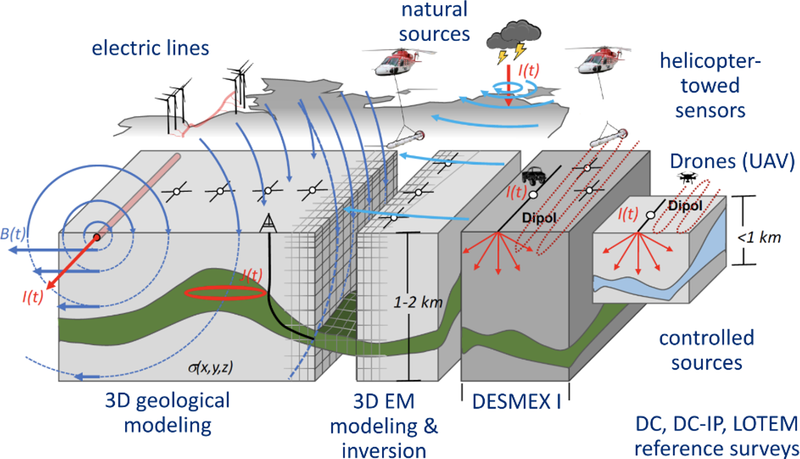

### Messkonzept

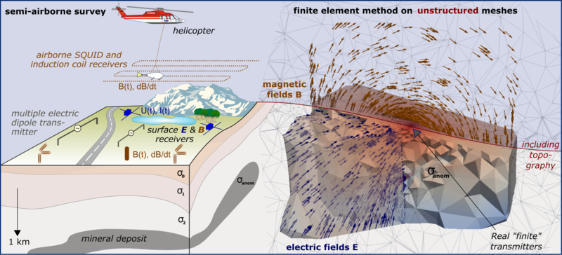

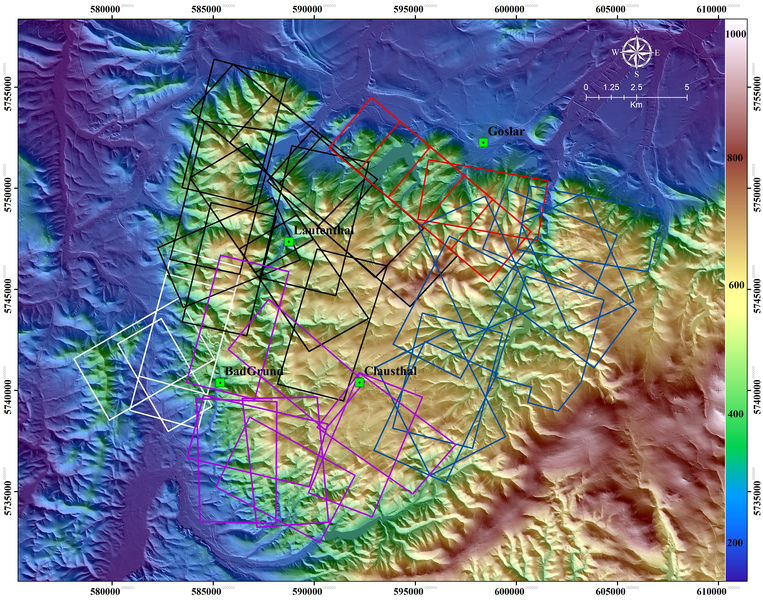


