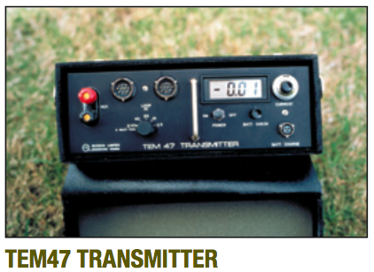
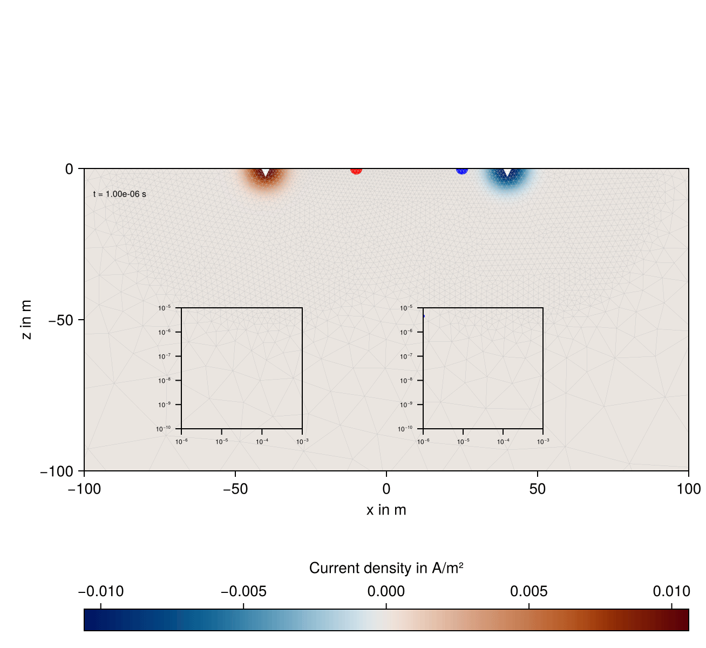
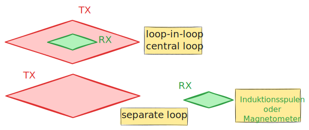
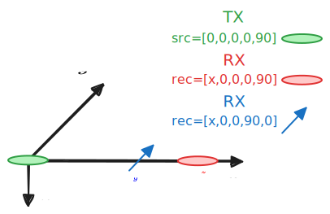

::: {.callout-tip title="Lernziele"}
- Zeitbereichs-EM
- Messgrößen
- Interpretation
- Grenzen
:::

## Grundlagen der Methode

Die Transientelektromagnetik (TEM), auch als Time-Domain-Elektromagnetik (TDEM) bekannt, ist eine Methode der geophysikalischen Exploration, die auf der Induktion von elektromagnetischen Feldern im Untergrund basiert. Sie wird insbesondere für die Untersuchung der elektrischen Leitfähigkeit geologischer Strukturen eingesetzt.

Die Entwicklung geht zurück auf die 1950er Jahre. Heute sind sowohl land- als auch luftgestützte Messsysteme im Einsatz.


{width="40%"}
{width="40%"}

## Prinzip der Methode

Bei der TEM-Methode wird ein primäres Magnetfeld durch eine Schleife oder eine Spule erzeugt, in der ein gepulster elektrischer Gleichstrom fließt. Beim abrupten Abschalten des Stroms bricht das Magnetfeld zusammen und induziert Wirbelströme im Untergrund, welche so orientiert sind, dass sie der Ursache ihre Entstehung entgegenwirken (_Lenzsche Regel_).

Die Wirbelströme besitzen ihrerseits ein sekundäres elektromagnetisches Feld, das mit Empfangsspulen oder Magnetometern bei Abwesenheit des primären Magnetfeldes gemessen wird.

Die zeitliche Entwicklung dieses sekundären Feldes hängt von der elektrischen Leitfähigkeit des Untergrunds ab.

### Beispiel: Zwei leitfähige horizontale Zylinder



### Messkonfigurationen

Es gibt verschiedene Konfigurationen für TEM-Messungen:

- **Zentrale Schleifenmessung (central loop, loop-in-loop):** Sender- und Empfangsschleife sind konzentrisch angeordnet.
- **Offset-Schleifenmessung (separate loops):** Der Empfänger ist außerhalb der Senderschleife positioniert, was eine größere Tiefenauflösung ermöglicht.
- **Borehole-TEM:** Die Empfängerspule wird in ein Bohrloch abgesenkt, um tiefere Strukturen detailliert zu erfassen.
Dipolmoment der horizontalen (an der Erdoberfläche ausgelegten) TX-Spule: $\vb{m} = I A \, \vb{e}_{z}$ 




## Vorteile und Anwendungsbereiche

**Vorteile:**

- Gute *Tiefenreichweite* (bis zu mehreren hundert Metern je nach Messkonfiguration und Untergrundbedingungen)
- Hohe *Sensitivität* für leitfähige Strukturen
- Vergleichsweise schnelle und effiziente Datenerhebung (**Simultane Multifrequenzmessung**)
- Messung in Abwesenheit des Primärfeldes

**Anwendungen:**

- Exploration von Grundwasserleitern (SkyTEM, Aarhus, DK)
- Kartierung von Erzlagerstätten und mineralischen Rohstoffen
- Untersuchung von kontaminierten Standorten und Umweltgeophysik
- Charakterisierung von geothermischen Reservoiren
- Monitoring von vulkanischer Aktivität

## Interpretation der Messergebnisse

Die Auswertung der Messdaten erfolgt über eine *Inversion* der gemessenen Transienten, um daraus ein Modell der elektrischen Leitfähigkeitsverteilung im Untergrund zu berechnen. Numerische Verfahren, wie 1D-, 2D- oder 3D-Modellrechnungen und Inversionsalgorithmen, werden zur Interpretation herangezogen.


[1D Inversion MATLAB](https://github.com/ruboerner/tem1dinv)


### Begriffe

- _step response_ Sprungfunktionsantwort: $\vb{E}, \vb{B}$
- _impulse response_ Impulsantwort: $\frac{ \partial \vb{B} }{ \partial t }$

Stromfunktion:
$$
I(t) = I_{0} u(t)
$$
$u(t)$: Heaviside-Sprungfunktion
$$
u(t) = \begin{cases}
0  & t<0 \\
1 & t>0
\end{cases}
$$


In der Praxis wird Feld nach Ausschalten des Stromes gemessen. Deshalb ist die Stromfunktion dann
$$
I(t) = I_{0} (1 - u(t))
$$

### Impulsantwort $f(t)$
Ausgangssignal eines Systems, bei dem am Eingang ein Diracimpuls zugeführt wird.

### Sprungfunktionsantwort $g(t)$
In der Praxis wird mit Sprungfunktion angeregt und die Sprungfunktionsantwort gemessen, die das Übertragungsverhalten eines Systems ebenfalls vollständig beschreibt.
Dadurch vermeidet man, einen Dirac-Impuls in der Stromfunktion 
$$
I_{\delta} = I_{0} \delta(t)
$$
realisieren zu müssen.


Zusammenhang zwischen beiden:
$$
\delta(t) = \frac{ \mathrm du }{ \mathrm dt }
$$

$$
f(t) = \frac{ \mathrm dg }{ \mathrm dt } 
$$

## Explizite Formeln für den homogenen Halbraum

Für den homogenen Halbraum gibt explizite Ausdrücke es für den Fall, dass sich TX und RX bei HCP-Konfiguration in der Ebene $z=0$ befinden:

$$
\begin{align}
E_\varphi & = -\frac{m}{2 \pi \sigma r^4} \left[
3 \mathrm{erf}(\Theta r) - \frac{2}{\sqrt{\pi}} \Theta r (3 + 2 \Theta^2 r^2 ) e^{-\Theta^2 r^2}
\right] \\
H_z & = \frac{m}{4 \pi r^3} \left[ 
    \frac{9}{2 \theta^2 r^2}\mathrm{erf}(\Theta r) -\mathrm{erf}(\Theta r) - \frac{1}{\sqrt{\pi}} \left(
        \frac{9}{\Theta r} + 4 \Theta r
    \right)
    e^{-\Theta^2 r^2}
\right] \\
\pdv{H_z}{t}  & = \frac{m}{2 \pi \mu_{0}\sigma r^5} \left[
    9 \mathrm{erf}(\Theta r) - \frac{2 \Theta r}{\sqrt{\pi}}
    \left(
        9 + 6 \Theta^2 r^2 + 4 \Theta^4 r^4
    \right)
    e^{-\Theta^2 r^2}
\right]
\end{align}
$$
$\Theta = \left( \dfrac{\sigma \mu_0}{4 t}\right)^{1/2}$, $\mathrm{ erf}()$ ist die Fehlerfunktion
$$
\mathrm{erf}(x) = \frac{2}{\sqrt{ \pi }}\int_{0}^{x} e^{ -t^{2} } \, \dd t 
$$

## Darstellung der Messgrößen
Transient: In der Induktionsspule induzierte Spannung als Funktion der Zeit

Beispiel: RX registriert $z$-Komponente, z.B. als liegende Schleife oder vertikale Zylinderspule. Dann ist
$$
U(t) \sim \frac{ \mathrm dB_{z}(t) }{ \mathrm dt } 
$$
mit
$$
B_{z} = \vb{B} \cdot \vb{e}_{z}
$$

## Modellstudien

- HCP-Konfiguration in der Ebene $z=0$.
- Homogener Halbraum mit $\rho=$ 100 $\Omega\cdot$m
- Geschichteter Halbraum
- Offset 100 m

Voraussetzung: Python-Bibliothek **`empymod`**

> ```console
> pip install empymod
> ```

## `empymod`

[Link](https://empymod.emsig.xyz/en/stable/)

### Koordinatensystem

`empymod` benutzt ein linkshändiges Koordinatensystem (LHS) mit


- $x$ nach Ost
- $y$ nach Nord
- $z$ nach unten
- $\theta$ Azimutwinkel E-N
- $\phi$ Dip-Winkel nach unten




## Beispiel

### TEM in HCP-Konfiguration, Impulsantwort

```python
import matplotlib.pyplot as plt
import numpy as np
import empymod

time = np.logspace(-6, 0, 61) # Sekunden

src = [0, 0, 0, 0, 90] # Dip 90 Grad
rec = [100, 0, 0, 0, 90] # Offset 100 m, Dip 90 Grad

depth = [0, 20, 30] # Meter
resistivity = [2e14, 100, 1, 100] # Ohm.m
eperm = [0, 0, 0, 0] # epsilon=0, quasistationär

inp = {'src': src, 
    'rec': rec,  
    'depth': depth, 
    'res': res,
    'freqtime': time,
     'verb': 1, 
     'xdirect': True, 
     'epermH': eperm}

dhz_num = empymod.loop(signal=0, **inp)
```


### Geschichteter vs. homogener Halbraum

$$
\begin{align}
\rho & = [100, 1, 100] \ \Omega\cdot m \\
d & = [20, 10] \ m \\
t & \in [10^{-6}, 1] \ s
\end{align}
$$

TX-RX-Offset: $100$ m, Konfiguration: HCP in $z=0$. Lufthalbraum: $\rho_{Air} = 2 \times  10^{14}\ \Omega \cdot m$

```{python}
import empymod
import numpy as np
import matplotlib.pyplot as plt

def pos(data):
    """Return positive data; set negative data to NaN."""
    return np.array([x if x > 0 else np.nan for x in data])


def neg(data):
    """Return -negative data; set positive data to NaN."""
    return np.array([-x if x < 0 else np.nan for x in data])

mu0 = np.pi * 4e-7

src = [0, 0, 0, 0, 90]
rec = [100, 0, 0, 0, 90]
depth = [0, 20, 30]
res_layered = [2e14, 100, 1, 100]

sigma_hom = 1e-2

time = np.logspace(-6, 0, 61)

inp = {'src': src, 'rec': rec, 'depth': depth, 'res': res_layered,
       'freqtime': time, 'verb': 1, 'xdirect': True, 'epermH': np.zeros_like(res_layered)}

dhz_num = empymod.loop(signal=0, **inp)
dhz_num *= mu0

inp = {'src': src, 'rec': [100, 0, 0, 0, 90],
        'depth': 0, 'res': [2e14, 100],
       'freqtime': time, 'verb': 1, 'xdirect': True, 'epermH': [0, 0]}


dhz_hom = empymod.loop(signal=0, **inp)
dhz_hom *= mu0

```


### Darstellungsform

Messgröße ist die in der Receiverspule induzierte Messspannung (Impulsantwort, _impulse response_), üblicherweise normiert auf die Stromstärke in der Transmitterspule.

Doppelt-logarithmisch, Zeiten logarithmisch äquidistant, meist 10 pro Dekade.

Im Beispiel: $10^{-6} \le t \le 1$ s.

```{python}
fig, ax = plt.subplots(figsize=(5, 4))

plt.plot(time*1e3, pos(dhz_num), 'C1-', label='layered')
plt.plot(time*1e3, neg(dhz_num), 'C1--')

plt.plot(time*1e3, pos(dhz_hom), 'C0-', label='hom.')
plt.plot(time*1e3, neg(dhz_hom), 'C0--')

plt.plot(time*1e3, 1e-19*time**(-5/2), 'C2-', label="LT", linewidth=0.5)

plt.xscale('log')
plt.yscale('log')
plt.xlim([1e-3, 1e3])
plt.yticks(10**np.arange(-18., -5))
plt.ylim([1e-18, 1e-6])
plt.xlabel('time in ms')
plt.ylabel(r'$\partial_t B_z(t)$ in $V/m^2$')
plt.title('Impulse response')
plt.legend()
# ax.set_aspect('equal')
plt.grid(alpha=0.4)
plt.tight_layout()
plt.show()
```

## Asymptotik

**Early time**

$$
\begin{align}
H_{z}^{E} & = -\frac{m}{4 \pi r^{3}} \left( 1 - \frac{18 t}{\sigma \mu_{0}r^{2}} \right)  \\
\frac{ \partial H_{z}^{E} }{ \partial t }  & = \frac{9 m}{2 \pi \sigma \mu_{0} r^{5}}
\end{align}
$$
Das Feld für $t\to 0$ entspricht dem Vakuumfeld einer HCP-Anordnung.

Die Zeitableitung von $\vb{H}$ fällt unabhängig von der Zeit mit der 5. Potenz des Abstandes zwischen TX und RX. Der Transient ist eine abklingende Funktion der Zeit.


Verdoppelt man den Abstand zwischen TX und RX, muss das Dipolmoment um den Faktor 32 vergrößert werden, um ein Messsignal der selben Größenordung zu erhalten.

## Asymptotik

**Late time**

$$
\begin{align}
H_{z}^{L}  & = \frac{m}{30}\left( \frac{\sigma \mu_{0}}{\pi t} \right)^{3/2} \\
\frac{ \partial H_{z}^{L} }{ \partial t }  & = -\frac{m}{20}\left( \frac{\sigma \mu_{0}}{\pi t^{5/3}} \right) ^{3/2}
\end{align}
$$
Das Magnetfeld geht mit $t^{-3/2}$ gegen Null.
Die Zeitableitung von $\vb{H}$ geht mit $t^{-5/2}$ gegen Null.

Aus den Messgrößen kann man den scheinbaren spezifischen Widerstand ableiten. Dies ist jedoch auf die Asymptoten beschränkt.


Für die Late-Time-Asymptotik gilt
$$
\rho_{s}^{L} = \frac{\mu_{0}}{\pi} \left( \frac{m}{20 t^{2}} \right)^{3/2} \left( -\frac{ \partial H_{z}^{L} }{ \partial t }  \right)  ^{-2/3}
$$
Die Berechnung des scheinbaren spezifischen Widerstandes ist als _Transformation_ geeignet, um den extremen Dynamikumfang von $\dfrac{ \partial H_{z} }{ \partial t }$ auf ein kleineres Zahlenintervall abzubilden. Dies ist bei der Inversion der TEM-Daten sinnvoll.

