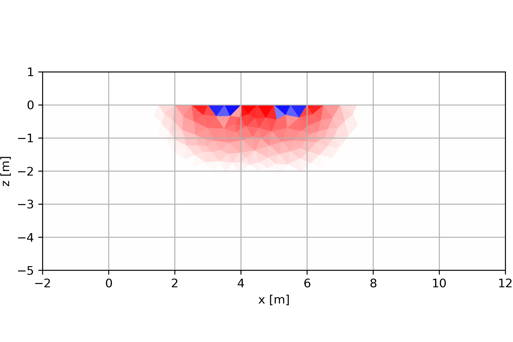
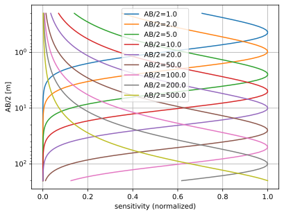
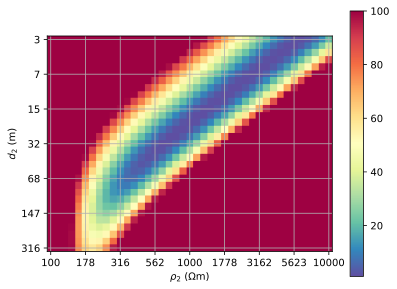
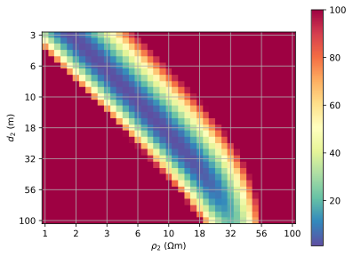

# Widerstands-Tiefensondierung

Eine Tiefensondierung erreicht man, indem man am gleichen Mess-Mittelpunkt die Elektrodenabstände (z.T. nur die der Stromelektroden) sukzessive erhöht.
Die dafür meist eingesetzte Anordnung ist die Schlumberger-Anordnung.
Dabei bleiben die Spannungselektroden konstant und die beiden Stromelektroden entfernen sich vom Mittelpunkt immer weiter.



## 1D-Sensitivitäten
### Horizontale Stromdichte
Untersuchen wir die Stromdichte einer Einspeisung zweier Stromelektroden A und B.

$j_x=\sigma\pdv{u}{x}=-\frac{I}{2\pi}\pdv{x} (\frac{1}{r_A}-\frac{1}{r_B})$

In der Mitte gilt $r_A=r_B$ und mit AB=$L$
$$j_x=\frac{I}{2\pi} \frac{L}{(z^2+L^2/4)^{3/2}}$$

```{python}
#| eval: true
#| echo: false
import numpy as np
import matplotlib.pyplot as plt
```
```{python}
#| eval: true
#| echo: true
#| code-line-numbers: false
zL = np.arange(0, 3, .01)
jx = 1/(zL**2+0.25)**1.5/2/np.pi
sumjx = np.cumsum(jx)
plt.plot(zL, jx/jx[0], label="jx")
plt.plot(zL, sumjx/sumjx[-1], label="sum")
plt.legend()
plt.xlabel("z/L")
plt.ylabel(r"$j_x$/$\Sigma j_x$ (normalized)")
plt.grid()
```

Wenn wir nun die horizontale Stromdichte über die y-Achse (in die Tafelebene hinein) aufintegrieren, erhalten wir
$$\frac{I_x}{I}(z)=\frac{L}{2\pi}\int\limits_{-\infty}^{\infty} \frac{dy}{(y^2+z^2+L^2/4)^{3/2}}$$

$$\frac{I_x}{I}(z)=\frac{2}{\pi}\arctan\frac{2z}{L} $$
- Hälfte des Gesamtstroms fließt zwischen Oberfläche und L/2

```{python}
#| eval: true
#| echo: true
#| code-line-numbers: false
plt.plot(zL, np.arctan(2*zL)*2/np.pi)
plt.xlabel("z/L")
plt.grid()
```

Die 1D Sensitivitätsfunktion für eine Pol-Pol-Messung ergibt sich mit  [@Guenther2004]
$$ s(z) = \frac{z}{\sqrt{a^2+z^2}^3} $$
und damit für eine Vier-Punkt-Messung
$$ s(z) = \frac{z}{\sqrt{AM^2+z^2}^3} - \frac{z}{\sqrt{BM^2+z^2}^3} - \frac{z}{\sqrt{AN^2+z^2}^3} + \frac{z}{\sqrt{BN^2+z^2}^3} $$

Für eine Schlumberger-Sondierung gilt $AM=BN=AB/2-MN/2$ und $AN=BM=AB/2+MN/2$
$$ s(z) = 2\frac{z}{\sqrt{(AB/2-MN/2)^2+z^2}^3} - 2\frac{z}{\sqrt{(AB/2+MN/2)^2+z^2}^3} $$

{width="150%"}

- logarithmisch äquidistante L (AB)
- Sondierungsparameter AB/2
- Maximum bei AB/2/2
- 90%-Summe bei AB/2*3

## Inversion am Beispiel Tiefensondierung

Während früher eine Auswertung mit Kurvenschablonen gemacht wurde, wird jetzt eine Inversionsrechnung durchgeführt.
Das Grundprinzip ist das Gleiche: die Anpassung der Daten durch iterative Veränderung des Modells.
Diese Datenanpassung wird quanitifiziert durch die sogenannte Zielfunktion, das Quadratmittel der Abweichung Daten und Modellantwort
  $$ \Phi=\sum (d_i-f_i(\vb m))^2 \rightarrow \min $$

Die Inversion minimiert diese Funktion durch die Methode der kleinsten Quadrate (Ähnlich lineare Regression).
Die wichtigste Zutat dabei sind die Sensitivitäten, d.h., wie sich eine Änderung der Untergrundsparameter (spez. Widerstände und Mächtigkeiten) auf die Vorwärtsantwort auswirkt ($\delta\rho\rightarrow\delta\rho_a$).

### Zielfunktion schlechter Leiter

Wir betrachten einen 3-Schicht-Fall mit Mächtigkeiten von 20m für die obersten beiden Schichten.
Eingebettet in einen 100 $\Omega$m Hintergrund sei zunächst ein schlechter Leiter mit 1000 $\Omega$m.
Wir interessieren uns der Einfachheit halber nur für die Mächtigkeit und den spez. Widerstand der mittleren Schicht.
Dazu variieren wir die beiden Werte systematisch über einen großen Bereich logarithmisch äquidistant und plotten die Zielfunktion a(dabei wurde die Farbskala stark eingeschränkt)



Wir beobachten ein langgestrecktes Minimum im zentralen Bereich um das synthetische Modell ($\rho_2$=1000$\Omega$m, $d_2$=20m) mit ähnlichen Werten auf einer Linie, die durch $\rho_2\cdot d_2$=20000$\Omega$m² beschrieben werden kann.
Das heißt, das die Kombinationen 2000$\Omega$m/10m und 500$\Omega$m/40m einen ähnlich guten Fit aufweisen.
Mit dieser Dünnschicht-Äquivalenz (das Problem verbessert sich bei mächtigeren Schichten) wird lediglich der Querwiderstand $\rho d$ aufgelöst.
Allerdings kann eine Untergrenze für den spez. Widerstand (300-400$\Omega$m) und eine Obergrenze der Mächtigkeit (60-70m) festgestellt werden.

### Zielfunktion guter Leiter

Jetzt wird die mittlere Schicht als guter Leiter mit 10$\Omega$m angenommen und ebenfalls die Zielfunktion geplottet.
Die Widerstandsskala wird dabei entsprechend angepasst.



Auch hier sehen wir wieder ein langgestrecktes Minimum um das synthetische Modell ($\rho_2$=10$\Omega$m, $d_2$=20m).
Allerdings ist die Ausrichtung entgegengesetzt, d.h. auf einer Linie die durch $d_2/\rho_2$=2S beschrieben wird.
Dieser Wert wird als Längsleitfähigkeit bezeichnet und ist ebenfalls eine Dünnschicht-Äquivalenz.
Hier kann eine Obergrenze für die Mächtigkeit $d_2$ von ca. 40m und den spez. Widerstand von ca. 25$\Omega$m festgestellt werden.
Mit diesen Grenzen kann unter Berücksichtigung von geometrischen, geologischen oder petrophysikalischen Informationen oft eine schlüssige Interpretation durchgeführt werden.
